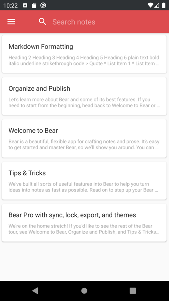
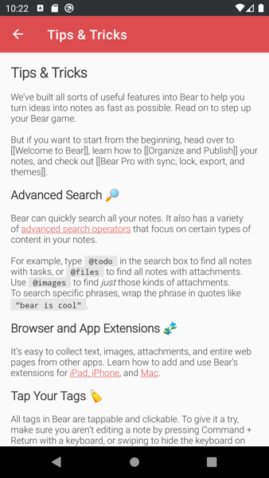

# Eisbär

An android application for [Bear](https://bear.app).

This app can browse notes from an SQLite database which was edited using the Bear MacOS/iOS app.

## Usage

* Copy the [Bear database file](https://bear.app/faq/Where%20are%20Bear%27s%20notes%20located/) to the downloads folder of your phone.
* In the Eisbär app, select the database file in the settings.

## Features

* Show notes (read-only)
* Search notes
* Markdown is rendered

### Not Now / Maybe later

* List of tags
* Support for images and attachments  
* Some kind of sync

### Probably never

* Edit notes
* Encrypted notes

## Screenshots

 

## Why requery and not Room?

This app uses [requery](https://github.com/requery/requery/) to read the SQLite database, because it supports partial models. With Room, the model entities must match the exact table specification or the database cannot be opened. 

## Credits

#### Logo image
copyright: [CC BY 4.0](https://creativecommons.org/licenses/by/4.0/), based on an image from [creativetail](https://www.creativetail.com)

source: https://www.brandeps.com/icon/B/Bear-01

